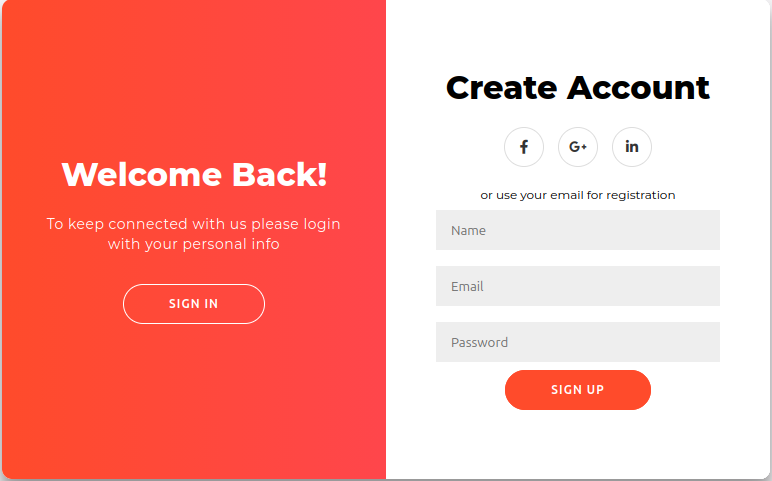

# ✨ Elegant Auth UI

A modern and elegant authentication interface featuring login and registration pages, built with HTML, CSS, and JavaScript.

This project focuses on clean design, responsive layouts, smooth interactions, and a pleasant user experience.

## 🚀 Features

* 🔐 Login and registration interfaces
* 🎨 Modern and elegant UI design
* 📱 Fully responsive layout
* ⚡ Interactive elements powered by JavaScript
* 🧹 Clean and well-structured code
* 🎯 Focus on UI/UX best practices

## 🛠️ Technologies

* HTML5
* CSS3
* JavaScript

## 📸 Preview

### 🔐 Login


### 📝 Registration



## 🎯 Purpose

This project was created to practice and showcase front-end development and UI/UX design skills, with a focus on creating modern, responsive, and user-friendly interfaces.

## 🌐 Live Demo

🚀 **Try the live version:**

[View Live Demo](https://nongoantonio.github.io/elegant_auth_ui/)

## 📂 Project Structure

```text
elegant_auth_ui/
│
├── assets/
│   ├── login.png
│   └── register.png
│
├── index.html
├── style.css
├── script.js
├── README.md
└── LICENSE
```

## 💻 Getting Started

### Clone the repository

```bash
git clone https://github.com/nongoantonio/elegant_auth_ui.git
```

### Navigate to the project

```bash
cd elegant_auth_ui
```

### Run the project

Open `index.html` directly in your browser or use the **Live Server** extension in Visual Studio Code for a better development experience.

## 👨‍💻 Author

**Gideão Hernández**

Front-End Developer focused on building modern, responsive, and user-friendly web interfaces.

---

⭐ If you like this project, consider giving the repository a star!
