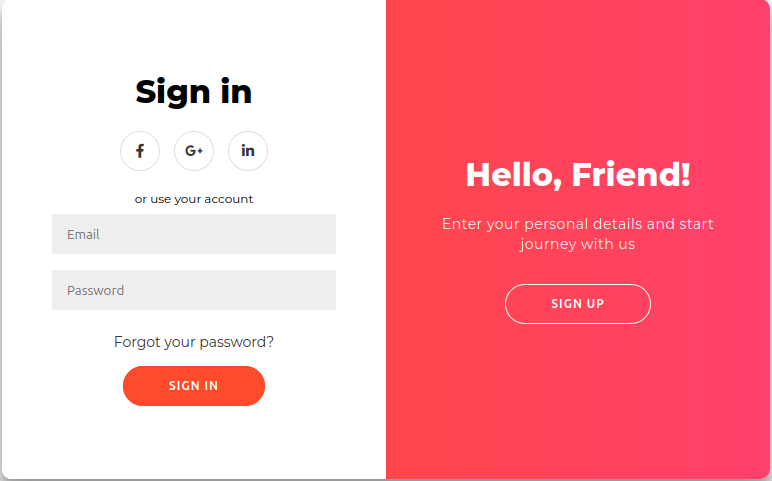

# ✨ Elegant Auth UI

Uma interface moderna e elegante de autenticação, desenvolvida com HTML, CSS e JavaScript.

O projeto apresenta páginas de login e cadastro com foco em uma experiência de usuário simples, responsiva e visualmente agradável.

## 📸 Preview



## 🚀 Features

* 🔐 Interface de login e cadastro
* 🎨 Design moderno e elegante
* 📱 Layout responsivo para diferentes dispositivos
* ⚡ Interações desenvolvidas com JavaScript
* 🧹 Código organizado e estruturado
* 🎯 Foco em UI/UX e experiência do usuário

## 🛠️ Technologies

* HTML5
* CSS3
* JavaScript

## 🎯 Purpose

Este projeto foi desenvolvido com o objetivo de praticar e aprimorar habilidades em desenvolvimento Front-End, criação de interfaces modernas e princípios de UI/UX.

## 🌐 Live Demo

🚀 Confira o projeto funcionando:

👉 https://nongoantonio.github.io/elegant_auth_ui/

## 📂 Project Structure

```text
elegant_auth_ui/
│
├── assets/
│   └── preview.png
│
├── index.html
├── style.css
├── script.js
├── README.md
└── LICENSE
```

## 💻 Getting Started

Clone o repositório:

```bash
git clone https://github.com/nongoantonio/elegant_auth_ui.git
```

Entre na pasta:

```bash
cd elegant_auth_ui
```

Depois, abra o arquivo `index.html` no navegador.

Para uma melhor experiência durante o desenvolvimento, você também pode utilizar a extensão Live Server no Visual Studio Code.

## 👨‍💻 Author

Gideão Hernández

Front-End Developer em formação, focado na criação de interfaces modernas, responsivas e experiências digitais intuitivas.

---

⭐ Se você gostou do projeto, considere deixar uma estrela no repositório!
